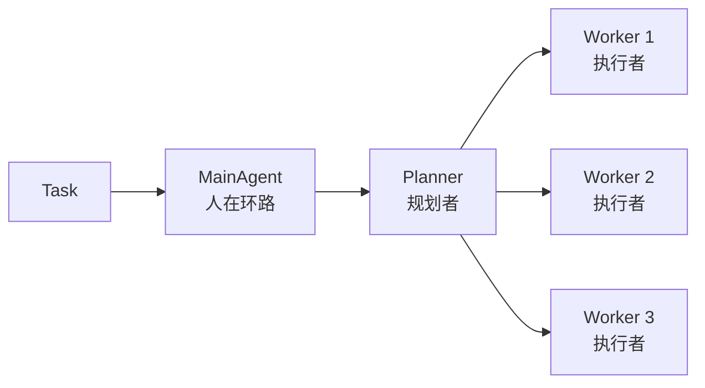

# Scenario vs Agent 深度概念分析

**分析日期**: 2026-08-30  
**核心问题**: 两个概念是否冗余？在新架构中的真实作用？应该保留哪个？

---

## 🎯 核心发现

### 关键洞察
1. **Agent本质上确实只是不同的System Prompt**
2. **Scenario和Agent概念高度重叠且冗余**
3. **ARTEX项目没有Scenario概念，只有Agent**
4. **新架构需要重新定义这两个概念**

---

## 第一部分：当前Liusha的概念混乱

### 1.1 Agent的真实本质

**Agent表的核心字段**:
```go
type Agent struct {
    Code          string
    Kind          Kind        // planner | executor
    Name          string
    Body          string      // ← 这就是System Prompt
    FunctionTools []string
    CliTools      []string
    Complexity    string
}
```

**关键发现**: 
- `Body`字段就是System Prompt（方法论charter）
- Agent的不同**仅仅是Prompt不同**
- 所以叫"Agent"**确实不合适**

**更准确的命名**:
- ❌ Agent（智能体）→ 暗示有独立推理能力
- ✅ **Role（角色）** → 更准确，表示"扮演某个角色"
- ✅ **Profile（配置档）** → 表示"一套配置"
- ✅ **Template（模板）** → 表示"提示词模板"

### 1.2 Scenario的真实本质

**Scenario表的核心字段**:
```go
type Scenario struct {
    Code         string
    Name         string
    Instruction  string      // ← 这也是System Prompt的一部分
    Engine       string      // solo | swarm
    SoloExecutorID *string   // 指向某个Agent
}
```

**关键发现**:
- `Instruction`字段也是System Prompt
- `Engine`字段决定执行流程（与新架构冲突）
- `SoloExecutorID`指向Agent（两个概念互相引用）

**Scenario的混乱**:
1. 既有Prompt（instruction）
2. 又决定执行模式（solo vs swarm）
3. 还引用Agent（solo_executor_id）
4. 概念边界不清晰

### 1.3 两者的重叠与冲突

**重叠点**:
| 维度 | Agent | Scenario | 冲突？ |
|------|-------|---------|--------|
| **System Prompt** | ✅ Body字段 | ✅ Instruction字段 | ⚠️ 都提供Prompt |
| **工具配置** | ✅ tools字段 | ❌ 无 | ✅ Agent独有 |
| **执行流程** | ❌ 无 | ✅ engine字段 | ⚠️ Scenario决定 |
| **复杂度** | ✅ complexity | ❌ 无 | ✅ Agent独有 |

**问题**:
1. Prompt被拆成两部分（Agent.Body + Scenario.Instruction）
2. 不清楚哪个优先级高
3. 两者组合方式不明确

---

## 第二部分：ARTEX的启示

### 2.1 ARTEX只有Agent配置表

**ARTEX的Agent表**（db/config.go）:
```go
type Agent struct {
    ID          int64
    Code        string
    Name        string
    Instruction string      // System Prompt
    Model       string      // LLM模型
    MaxTurns    int
    Enabled     bool
    CreatedAt   time.Time
    UpdatedAt   time.Time
}
```

**ARTEX没有Scenario概念！**

**ARTEX的Agent类型**:
1. **MainAgent** - 人在环路（对话接口）
2. **Planner** - 规划者（唯一意图生成者）
3. **Worker** - 执行者（×N并发）

**关键洞察**:
- ARTEX用**代码固定**三种Agent角色
- 用**配置表**存储可变的Prompt
- **没有"场景"这个中间层**

### 2.2 ARTEX的执行流程



**特点**:
1. **没有Scenario选择执行模式**
2. **始终是：MainAgent → Planner → Workers**
3. **配置在Agent表，而非Scenario表**

### 2.3 ARTEX vs Liusha 对比

| 维度 | ARTEX | Liusha（当前） | 问题 |
|------|-------|---------------|------|
| **执行角色** | MainAgent, Planner, Worker（代码固定） | Planner, Executor（配置表） | Liusha混入配置 |
| **Prompt配置** | Agent表（instruction字段） | Agent.Body + Scenario.Instruction | 分散两处 |
| **执行模式** | 代码固定（始终Planner+Worker） | Scenario.engine（solo/swarm） | 可配置导致冲突 |
| **场景概念** | ❌ 无 | ✅ 有 | Liusha多一层 |

**启示**:
- ARTEX的设计更清晰：**角色在代码，配置在表**
- Liusha把角色也放配置表，导致混乱

---

## 第三部分：新架构的真实需求

### 3.1 新架构的固定流程

```
所有任务：Orchestrator → Planner（6分钟评估） → Executor（5步评估）
```

**关键点**:
1. **流程是固定的**（不可配置）
2. **没有solo模式**（所有任务都有Planner）
3. **Orchestrator、Planner、Executor是框架层**

### 3.2 什么需要配置？

**需要配置的**:
1. ✅ System Prompt（方法论、指令）
2. ✅ 工具集（function tools, cli tools）
3. ✅ 复杂度（simple/medium/complex）
4. ✅ 模型选择（可能）

**不需要配置的**:
1. ❌ 执行流程（始终Planner+Executor）
2. ❌ 角色类型（Planner和Executor是代码固定的）
3. ❌ 监察机制（6分钟、5步是代码固定的）

### 3.3 场景的真实需求

**用户视角的"场景"**:
- "我要测试SQL注入"
- "我要做XSS扫描"
- "我要进行权限提升"

**场景应该提供什么**:
1. ✅ 场景描述（目标是什么）
2. ✅ 场景指令（注入到Prompt）
3. ✅ 推荐配置（默认工具、复杂度）
4. ❌ **不应该决定执行流程**

---

## 第四部分：重新设计方案

### 方案A：只保留Profile（推荐）

**删除**:
- ❌ Agent表
- ❌ Scenario表

**新增**:
```sql
CREATE TABLE profile (
    id          uuid PRIMARY KEY,
    code        text NOT NULL UNIQUE,
    name        text NOT NULL,
    
    -- Prompt配置
    system_prompt    text NOT NULL,        -- 完整System Prompt
    
    -- 执行配置
    tools            jsonb NOT NULL DEFAULT '[]',
    max_iterations   int NOT NULL DEFAULT 40,
    complexity       text NOT NULL DEFAULT 'medium',
    
    -- 元数据
    category         text,                  -- 分类（可选，如：sql-injection, xss）
    description      text,
    enabled          boolean NOT NULL DEFAULT true,
    created_at       timestamptz NOT NULL DEFAULT now(),
    updated_at       timestamptz NOT NULL DEFAULT now()
);
```

**使用方式**:
```go
// 代码中固定角色
type Role string
const (
    RolePlanner  Role = "planner"   // 宏观规划（代码固定）
    RoleExecutor Role = "executor"  // 微观执行（代码固定）
)

// 用户选择Profile
task := CreateTask{
    ProfileCode: "web-sql-injection",  // 引用profile配置
}

// 运行时
profile := store.GetProfile("web-sql-injection")
executor := NewExecutor(profile.SystemPrompt, profile.Tools)
```

**优点**:
- ✅ 概念清晰（Profile = 一套配置）
- ✅ 没有冗余（只有一张表）
- ✅ 角色在代码（Planner/Executor固定）
- ✅ 配置在表（system_prompt等）

---

### 方案B：保留Scenario，删除Agent

**保留**:
- ✅ Scenario表

**重构Scenario**:
```sql
CREATE TABLE scenario (
    id          uuid PRIMARY KEY,
    code        text NOT NULL UNIQUE,
    name        text NOT NULL,
    
    -- Planner配置
    planner_prompt   text NOT NULL,       -- Planner的System Prompt
    
    -- Executor配置
    executor_prompt  text NOT NULL,       -- Executor的System Prompt
    executor_tools   jsonb NOT NULL DEFAULT '[]',
    
    -- 执行配置
    default_complexity text NOT NULL DEFAULT 'medium',
    
    -- 元数据
    category         text,
    description      text,
    enabled          boolean NOT NULL DEFAULT true,
    
    -- 删除
    -- engine (违反新架构)
    -- solo_executor_id (违反新架构)
);
```

**使用方式**:
```go
task := CreateTask{
    ScenarioCode: "web-sql-injection",
}

// 运行时
scenario := store.GetScenario("web-sql-injection")
planner := NewPlanner(scenario.PlannerPrompt)
executor := NewExecutor(scenario.ExecutorPrompt, scenario.ExecutorTools)
```

**优点**:
- ✅ 保留"场景"概念（用户友好）
- ✅ 统一配置（Planner + Executor在一起）

**缺点**:
- ⚠️ 一个Scenario绑定一套Planner+Executor配置
- ⚠️ 不够灵活（无法复用Prompt）

---

### 方案C：两者都保留，重新定义关系（不推荐）

**Agent → Role（角色配置）**:
```sql
CREATE TABLE role (
    id          uuid PRIMARY KEY,
    code        text NOT NULL UNIQUE,
    kind        text NOT NULL CHECK (kind IN ('planner','executor')),
    name        text NOT NULL,
    system_prompt text NOT NULL,
    tools         jsonb NOT NULL DEFAULT '[]',
    complexity    text NOT NULL DEFAULT 'medium',
    enabled       boolean NOT NULL DEFAULT true
);
```

**Scenario → 场景（组合角色）**:
```sql
CREATE TABLE scenario (
    id          uuid PRIMARY KEY,
    code        text NOT NULL UNIQUE,
    name        text NOT NULL,
    planner_id  uuid REFERENCES role(id),    -- 引用planner角色
    executor_id uuid REFERENCES role(id),    -- 引用executor角色
    instruction text NOT NULL DEFAULT '',    -- 额外指令（注入到Prompt）
    category    text,
    enabled     boolean NOT NULL DEFAULT true
);
```

**使用方式**:
```go
scenario := store.GetScenario("web-sql-injection")
planner := NewPlanner(scenario.PlannerRole.SystemPrompt + scenario.Instruction)
executor := NewExecutor(scenario.ExecutorRole.SystemPrompt + scenario.Instruction)
```

**优点**:
- ✅ 角色可复用（多个Scenario可共享Role）
- ✅ 灵活组合

**缺点**:
- ❌ 概念复杂（两层抽象）
- ❌ 配置分散（Prompt分散在Role和Scenario）
- ❌ 用户理解成本高

---

## 📊 最终建议

### 推荐：方案A（只保留Profile）

**理由**:
1. ✅ **概念最简单**（一张表解决所有配置）
2. ✅ **与新架构一致**（角色固定，配置灵活）
3. ✅ **学习ARTEX**（角色在代码，配置在表）
4. ✅ **无冗余**（不会有重叠字段）

**实施**:
```sql
-- 1. 创建profile表
CREATE TABLE profile (
    id            uuid PRIMARY KEY,
    code          text NOT NULL UNIQUE,
    name          text NOT NULL,
    system_prompt text NOT NULL,
    tools         jsonb NOT NULL DEFAULT '[]',
    max_iterations int NOT NULL DEFAULT 40,
    complexity    text NOT NULL DEFAULT 'medium',
    category      text,
    description   text,
    enabled       boolean NOT NULL DEFAULT true,
    created_at    timestamptz NOT NULL DEFAULT now(),
    updated_at    timestamptz NOT NULL DEFAULT now()
);

-- 2. 迁移数据
-- 从Agent表迁移kind='executor'的数据到profile
INSERT INTO profile (code, name, system_prompt, tools, complexity)
SELECT code, name, body, tools, complexity
FROM agent WHERE kind = 'executor';

-- 3. 删除旧表
DROP TABLE scenario;
DROP TABLE agent;
```

**代码中**:
```go
// internal/executor/executor.go
type Executor struct {
    profile Profile  // 注入Profile配置
}

// internal/planner/planner.go  
type Planner struct {
    // Planner的Prompt是框架固定的，不从配置表读
}

// cmd/runner/handler.go
func (h handler) handleTask(ctx context.Context, taskID string) {
    // 1. 获取Profile
    profile := h.store.GetProfile(task.ProfileCode)
    
    // 2. 始终使用：Orchestrator → Planner → Executor
    orchestrator := NewOrchestrator()
    planner := NewPlanner()  // 固定Prompt
    executor := NewExecutor(profile)  // 使用Profile
    
    // 3. 执行（无solo模式）
    orchestrator.Run(planner, executor)
}
```

---

## 🎯 核心结论

### 概念澄清

1. **Agent = 不同的Prompt** ✅
   - 本质就是System Prompt配置
   - 叫"Agent"不准确
   - 更好的命名：**Profile（配置档）**

2. **Scenario与Agent冗余** ✅
   - Scenario.instruction = Prompt的一部分
   - Scenario.engine = 违反新架构
   - Scenario.solo_executor_id = 引用Agent
   - **两个概念做同样的事**

3. **新架构不需要"选择执行模式"** ✅
   - 所有任务都走：Planner → Executor
   - 不需要solo/swarm选择
   - 流程是代码固定的

### 最终方案

**删除两个旧概念，引入Profile**:
- ❌ 删除 Agent表（概念混乱）
- ❌ 删除 Scenario表（冗余+违反新架构）
- ✅ 新增 **Profile表**（清晰的配置档）
- ✅ 代码固定角色（Planner, Executor, Orchestrator）
- ✅ 配置表存储Prompt和工具

**命名对比**:
| 旧命名 | 问题 | 新命名 | 优势 |
|-------|------|--------|------|
| Agent | 暗示智能体 | Profile | 配置档（准确） |
| Scenario | 与Agent重叠 | - | 删除（无需中间层） |
| engine字段 | 违反新架构 | - | 删除（流程固定） |

---

**完成时间**: 2026-08-30  
**建议**: 删除Agent和Scenario，统一为Profile配置表
